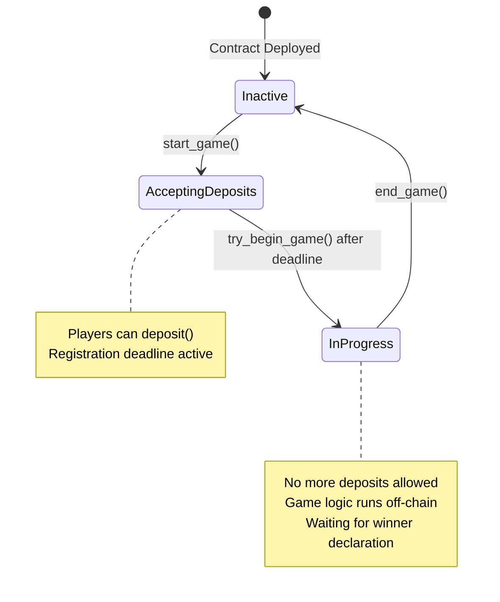

# Design Document

## Overview

The Agario Buy-in Smart Contract is an ink! smart contract that manages the financial aspects of an Agario-like game. It provides a secure, transparent on-chain treasury system that handles player deposits, escrow management, and prize distribution. The contract is designed to be simple, secure, and gas-efficient while following ink! best practices.

The contract operates as a state machine with three distinct phases: Inactive (ready for new game), AcceptingDeposits (registration period), and InProgress (game active). Only the game administrator can transition between certain states, while any user can trigger automatic state transitions when conditions are met.

## Architecture

### Contract Structure

```rust
#[ink::contract]
mod agario_buyin {
    use ink::storage::Mapping;
    
    #[ink(storage)]
    pub struct AgarioBuyin {
        // Administrative
        game_admin: AccountId,
        admin_fee_percentage: u8,
        
        // Game State
        game_state: GameState,
        buy_in_amount: Balance,
        registration_deadline: Timestamp,
        
        // Player Management
        players: Mapping<AccountId, ()>,
        player_count: u32,
        prize_pool: Balance,
    }
}
```

### State Machine Design



### Access Control Model

- **Game Administrator**: Can start games, end games, and receive admin fees
- **Players**: Can deposit funds during registration period
- **Anyone**: Can trigger automatic state transitions via `try_begin_game()`## Compo
nents and Interfaces

### Core Data Types

```rust
#[derive(Debug, PartialEq, Eq, scale::Encode, scale::Decode)]
#[cfg_attr(feature = "std", derive(scale_info::TypeInfo))]
pub enum GameState {
    Inactive,
    AcceptingDeposits,
    InProgress,
}

#[derive(Debug, PartialEq, Eq, scale::Encode, scale::Decode)]
#[cfg_attr(feature = "std", derive(scale_info::TypeInfo))]
pub enum Error {
    NotAdmin,
    GameNotInCorrectState,
    IncorrectBuyInAmount,
    PlayerAlreadyDeposited,
    NoWinners,
    RegistrationPeriodNotOver,
    RegistrationPeriodOver,
    TransferFailed,
}
```

### Public Interface

#### Constructor
```rust
#[ink(constructor)]
pub fn new(admin_fee: u8) -> Result<Self, Error>
```
- Initializes contract with admin fee percentage (0-100)
- Sets caller as game administrator
- Starts in Inactive state

#### Administrative Functions
```rust
#[ink(message)]
pub fn start_game(&mut self, buy_in: Balance, registration_period: Timestamp) -> Result<(), Error>

#[ink(message)]
pub fn end_game(&mut self, winners: Vec<AccountId>) -> Result<(), Error>
```

#### Player Functions
```rust
#[ink(message, payable)]
pub fn deposit(&mut self) -> Result<(), Error>

#[ink(message)]
pub fn try_begin_game(&mut self) -> Result<(), Error>
```

#### Query Functions
```rust
#[ink(message)]
pub fn get_game_state(&self) -> GameState

#[ink(message)]
pub fn get_player_count(&self) -> u32

#[ink(message)]
pub fn get_prize_pool(&self) -> Balance

#[ink(message)]
pub fn is_player_registered(&self, player: AccountId) -> bool
```###
 Event System

```rust
#[ink(event)]
pub struct GameStarted {
    #[ink(topic)]
    buy_in_amount: Balance,
    #[ink(topic)]
    deadline: Timestamp,
}

#[ink(event)]
pub struct PlayerDeposited {
    #[ink(topic)]
    player: AccountId,
    amount: Balance,
}

#[ink(event)]
pub struct GameBegan {
    player_count: u32,
    total_prize_pool: Balance,
}

#[ink(event)]
pub struct GameEnded {
    #[ink(topic)]
    winners: Vec<AccountId>,
    admin_payout: Balance,
    winner_payout: Balance,
}
```

## Data Models

### Storage Layout

The contract uses ink!'s efficient storage patterns:

- **Mapping for Players**: `ink::storage::Mapping<AccountId, ()>` provides O(1) lookup and insertion
- **Primitive Types**: Direct storage for counters, balances, and state
- **No Dynamic Collections**: Avoids `Vec` for gas efficiency, uses mapping + counter pattern

### Storage Key Design

```rust
// Root storage struct at key 0x00000000
// Individual mappings use Blake2_128Concat hashing
// Players mapping: Blake2_128Concat::hash(player_account_id) -> ()

// Storage access via contractsApi.getStorage:
// - contract_address: SS58 address of deployed contract
// - storage_key: "0x00000000" for root struct
// - Returns: SCALE-encoded AgarioBuyin struct
```

### Child Trie Storage Architecture

ink! contracts use child tries for storage isolation:

```rust
// Child trie ID calculation:
// trie_id = Blake2_256::hash((deployer_account_id, instantiation_nonce))
// PrefixedStorageKey = ChildInfo::new_default(&trie_id).into_prefixed_storage_key()

// This enables:
// - Storage isolation between contracts
// - Efficient storage queries via childState RPC
// - Direct storage access for debugging and monitoring
```

### Memory Management

- **Deposit Reclamation**: Players can potentially reclaim storage deposits if removal functions are added
- **Fallible Operations**: Use `try_*` methods for any dynamic data operations
- **Buffer Management**: All operations stay within 16 KiB static buffer limits##
 Error Handling

### Error Strategy

The contract implements comprehensive error handling using Result types:

```rust
pub type Result<T> = core::result::Result<T, Error>;
```

### Error Categories

1. **Access Control Errors**: `NotAdmin`
2. **State Validation Errors**: `GameNotInCorrectState`, `RegistrationPeriodNotOver`, `RegistrationPeriodOver`
3. **Business Logic Errors**: `IncorrectBuyInAmount`, `PlayerAlreadyDeposited`, `NoWinners`
4. **System Errors**: `TransferFailed`

### Error Handling Pattern

```rust
#[ink(message)]
pub fn some_function(&mut self) -> Result<(), Error> {
    // Validate preconditions
    if !self.is_valid_state() {
        return Err(Error::GameNotInCorrectState);
    }
    
    // Perform operations
    self.update_state();
    
    // Emit events
    self.env().emit_event(SomeEvent { ... });
    
    Ok(())
}
```

## Security Design

### Checks-Effects-Interactions Pattern

The `end_game` function implements the CEI pattern:

```rust
#[ink(message)]
pub fn end_game(&mut self, winners: Vec<AccountId>) -> Result<(), Error> {
    // CHECKS
    if self.env().caller() != self.game_admin {
        return Err(Error::NotAdmin);
    }
    if self.game_state != GameState::InProgress {
        return Err(Error::GameNotInCorrectState);
    }
    if winners.is_empty() {
        return Err(Error::NoWinners);
    }
    
    // EFFECTS
    let admin_cut = self.prize_pool * self.admin_fee_percentage as Balance / 100;
    let winner_share = (self.prize_pool - admin_cut) / winners.len() as Balance;
    
    self.game_state = GameState::Inactive;
    self.reset_game_state();
    
    // INTERACTIONS
    self.env().transfer(self.game_admin, admin_cut)?;
    for winner in &winners {
        self.env().transfer(*winner, winner_share)?;
    }
    
    self.env().emit_event(GameEnded { ... });
    Ok(())
}
```

### Access Control

- **Role-based Access**: Only admin can start/end games
- **State-based Access**: Functions check game state before execution
- **Temporal Access**: Registration deadline enforced automatically

### Reentrancy Protection

- State changes occur before external calls
- No recursive function calls possible
- Transfer failures are handled gracefully##
 Testing Strategy

### Unit Testing Approach

```rust
#[cfg(test)]
mod tests {
    use super::*;
    use ink::env::test;
    
    #[ink::test]
    fn test_constructor() {
        let contract = AgarioBuyin::new(5).unwrap();
        assert_eq!(contract.game_state, GameState::Inactive);
    }
    
    #[ink::test]
    fn test_start_game() {
        // Test game initialization
    }
    
    #[ink::test]
    fn test_deposit_flow() {
        // Test player deposit process
    }
    
    #[ink::test]
    fn test_end_game_distribution() {
        // Test prize distribution logic
    }
}
```

### Test Categories

1. **Constructor Tests**: Verify proper initialization
2. **State Transition Tests**: Ensure correct state machine behavior
3. **Access Control Tests**: Verify permission enforcement
4. **Business Logic Tests**: Test deposit, prize calculation, and distribution
5. **Error Condition Tests**: Verify all error paths
6. **Event Emission Tests**: Ensure proper event generation
7. **Integration Tests**: End-to-end game flow scenarios

### Security Testing

- **Reentrancy Tests**: Verify CEI pattern effectiveness
- **Access Control Tests**: Attempt unauthorized operations
- **State Manipulation Tests**: Try invalid state transitions
- **Balance Tests**: Verify arithmetic correctness and overflow protection

### Gas Optimization Testing

- **Storage Access Patterns**: Measure gas costs for different operations
- **Batch Operations**: Test multiple deposits in sequence
- **State Cleanup**: Verify efficient state reset

## Performance Considerations

### Gas Efficiency

- **Mapping Usage**: O(1) player lookups vs O(n) vector searches
- **Event Indexing**: Strategic use of `#[ink(topic)]` for efficient filtering
- **State Minimization**: Only store essential data on-chain

### Scalability

- **Player Limits**: No hard limit on players (bounded by gas costs)
- **Prize Distribution**: Linear cost with number of winners
- **Storage Growth**: Mapping grows with unique players but can be cleaned up

### Frontend Integration

- **Event Filtering**: Topics allow efficient event querying
- **State Queries**: Read-only functions for UI updates
- **Error Handling**: Structured errors for user feedback
## Deve
lopment and Deployment Workflow

### Build Process

```bash
# Build contract for development
cargo contract build

# Build with linting (recommended)
cargo contract build --lint

# Run unit tests
cargo test

# Run E2E tests (requires running node)
cargo test --features e2e-tests
```

### Deployment Process

```bash
# Deploy to local development node
cargo contract instantiate --suri //Alice --args 5 -x

# Deploy to testnet
cargo contract instantiate --suri <PRIVATE_KEY> --args 5 -x --url <TESTNET_URL>

# Verify deployment by querying storage
cargo contract storage --contract <CONTRACT_ADDRESS>
```

### Storage Inspection and Debugging

The contract supports comprehensive storage inspection using ink!'s built-in tools:

```bash
# Query all contract storage
cargo contract storage --contract <CONTRACT_ADDRESS>

# Query specific storage keys
cargo contract storage --contract <CONTRACT_ADDRESS> --key 0x00000000
```

Expected storage layout:
```
+-------+----------+--------+----------------------------------+
| Index | Root Key | Parent | Value                            |
+=====================================================+
| 0     | 00000000 | root   | AgarioBuyin { game_state: ..., } |
+-------+----------+--------+----------------------------------+
```

### Live State Testing with Chopsticks

For testing against live chain state:

```yaml
# dev.yml - Chopsticks configuration
endpoint: ws://127.0.0.1:9944
mock-signature-host: true
block: 1
db: ./db.sqlite
```

```bash
# Start Chopsticks fork
chopsticks --config=dev.yml

# Deploy and test on fork
cargo contract instantiate --suri //Alice --args 5 -x --url ws://localhost:8000
CONTRACT_ADDR_HEX=<ADDRESS> cargo test --features e2e-tests
```

## Contract Metadata and ABI

The contract generates comprehensive metadata for frontend integration:

### ABI Structure
- **Constructor**: `new(admin_fee: u8)`
- **Messages**: All public functions with proper parameter types
- **Events**: All events with indexed topics for efficient filtering
- **Errors**: Structured error enum for precise error handling

### Frontend Integration Points

```typescript
// Example polkadot-js integration
import { ApiPromise, WsProvider } from '@polkadot/api';
import { ContractPromise } from '@polkadot/api-contract';

const api = await ApiPromise.create({ provider: new WsProvider('ws://localhost:9944') });
const contract = new ContractPromise(api, abi, contractAddress);

// Query game state
const { result, output } = await contract.query.getGameState(
  alice.address,
  { gasLimit: -1 }
);

// Submit deposit transaction
await contract.tx.deposit({ gasLimit: -1, value: buyInAmount })
  .signAndSend(playerAccount);
```

## Security Considerations

### Linter Compliance

The contract is designed to pass all ink! linter rules:

- **no_main**: Contract uses `#![cfg_attr(not(feature = "std"), no_std, no_main)]`
- **primitive_topic**: Events use AccountId/Balance types, not primitives for topics
- **storage_never_freed**: Mapping entries can be cleared (future enhancement)
- **strict_balance_equality**: No strict balance comparisons used
- **non_fallible_api**: Uses `try_*` methods for dynamic data operations

### Audit Checklist

1. **Access Control**: Admin-only functions properly protected
2. **State Transitions**: Invalid state changes prevented
3. **Arithmetic Safety**: No overflow/underflow vulnerabilities
4. **Reentrancy**: CEI pattern implemented in critical functions
5. **Event Emission**: All state changes emit appropriate events
6. **Error Handling**: Comprehensive error coverage with specific types